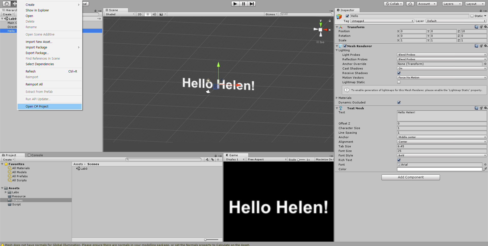
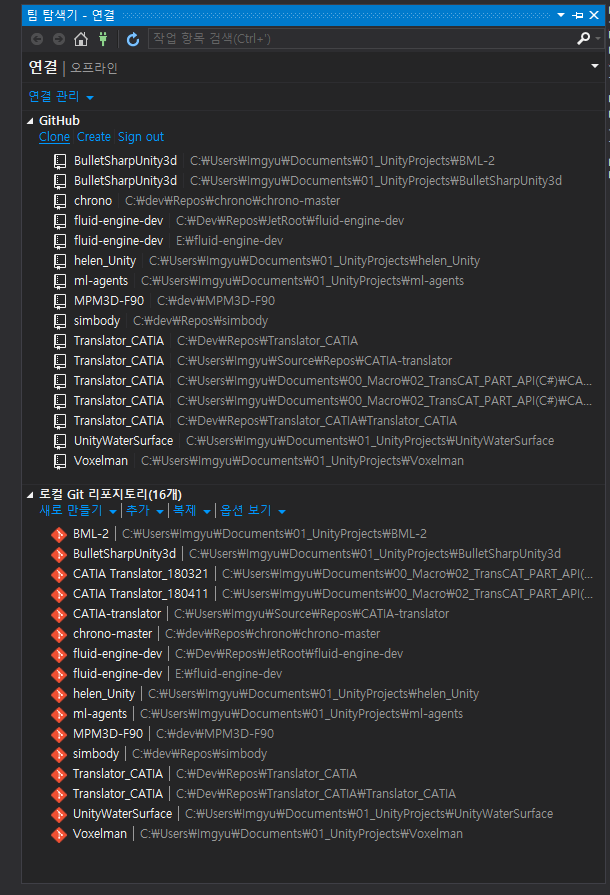
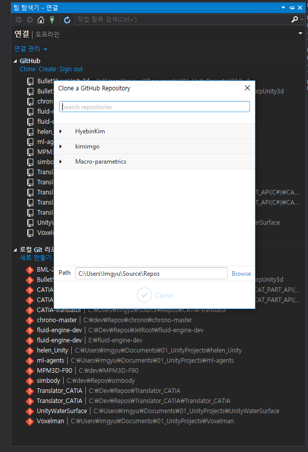

# Lab0

## 수행 내용
github와 협업 개발에 대한 대략적인 공부를 수행
https://milooy.wordpress.com/2017/06/21/working-together-with-github-tutorial/
https://gmlwjd9405.github.io/2017/10/27/how-to-collaborate-on-GitHub-1.html
https://nolboo.kim/blog/2013/08/29/how-to-collaborate-on-github/

1. Git hub clone
2. Hello Helen 텍스트 매쉬에 Hello imgyu 추가
3. commit & push

### 주의사항
1. Visual studio 2015 or 2017에서 코드를 수정할 것.
2. 수정의 확인은 Unity scene, game 창에서.

### 참고자료 
http://vallista.tistory.com/entry/Git-Hub-%EC%82%AC%EC%9A%A9%EB%B2%95?category=551637
http://vallista.tistory.com/entry/visual-studio-2015-Community-Git-Hub-%EC%97%B0%EB%8F%99?category=551637
https://docs.unity3d.com/Manual/class-TextMesh.html
